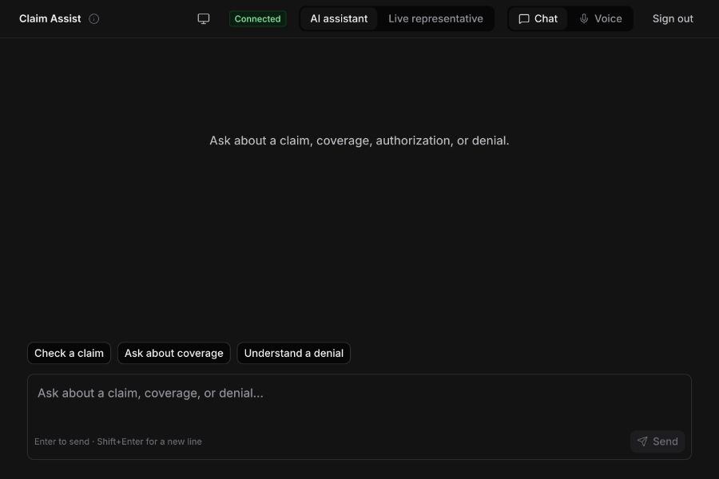
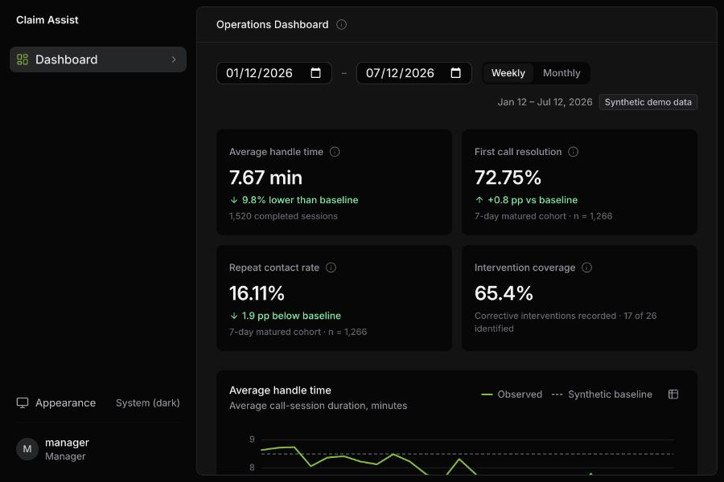
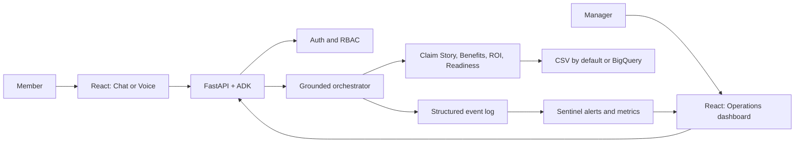

# Claim Assist

> A grounded, role-aware claims-assistance prototype that helps people understand claims, coverage, authorization requirements, and next steps—while giving operations teams a clear view of service performance and actionable claim-readiness work.

Built for the 2026 Humana hackathon, Claim Assist pairs a React experience with a FastAPI and Google Agent Development Kit (ADK) backend. It is designed to make complex claims conversations clearer without letting an LLM invent coverage, denial, authorization, or readiness facts.





## What it does

Claim Assist has three role-aware experiences:

- **Members** can use Chat or Voice—switching between them without losing the conversation—to ask about a claim, coverage, authorization, or denial. The app returns structured, safe summaries alongside the conversation.
- **Managers** use a live dashboard to explore labeled synthetic operations metrics: average handle time, first-call resolution, repeat contacts, routing volume, representative workload, and corrective-intervention coverage.
- **Representatives** have an intentionally synthetic queue/workspace demonstration today; the backend already exposes capability-protected queue and conversation APIs for the next integration step.

Behind these experiences, the ADK orchestrator coordinates focused Claim Story, benefits, release-of-information (ROI), and claim-readiness capabilities. Deterministic services and typed contracts supply the facts; the model is used for helpful narration and intent handling rather than adjudication.

## Highlights

- Role-based authentication with HTTP-only session cookies and protected REST/WebSocket routes.
- First-class Chat and Voice modes over one persistent conversation session.
- Exact-claim stories and deterministic benefit, ROI, and rules-based claim-readiness guidance.
- A fail-closed ROI gate: when authority to discuss another adult member's information is missing or unclear, the app limits disclosure and provides the proper path forward.
- A bounded, restart-safe readiness scan that creates prioritized representative work items from reviewed rules.
- Asynchronous Sentinel monitoring for structured events, explainable alerts, and local operational metrics.
- An offline evaluation corpus for grounding, ROI/disclosure safety, reviewed readiness rules, routing behavior, and latency.

## Architecture at a glance



The backend persists local demo users, synthetic operations history, work items, event metadata, and idempotency records in SQLite. ADK sessions and session-summary projections are intentionally process-local for this prototype.

## Quick start

### Prerequisites

- Python 3.14 and [uv](https://docs.astral.sh/uv/)
- Node.js and [pnpm](https://pnpm.io/)
- Optional for live model and BigQuery use: Google Cloud credentials configured with Application Default Credentials

### Run the local demo

1. Configure and start the backend:

   ```shell
   cd backend
   cp .env.example .env
   uv sync
   uv run python -m src.operations.bootstrap
   uv run uvicorn main:app --reload --host 127.0.0.1 --port 8000
   ```

   The default benefits data source is the tracked CSV reference data, so basic local startup does not require BigQuery access. Fill the required Google Cloud and GCS values in `backend/.env` when exercising credentialed ADK/Vertex or BigQuery paths.

2. In another terminal, start the frontend:

   ```shell
   cd frontend
   pnpm install
   pnpm dev
   ```

3. Open `http://127.0.0.1:5173`.

The Vite server proxies `/api` and `/ws` to `http://127.0.0.1:8000`, so local cookies and conversation connections work as one application.

### Development accounts

The bootstrap command creates synthetic, local-only accounts:

| Role | Username | Password | Primary experience |
|---|---|---|---|
| Manager | `manager` | `ManagerDemo2026!` | Operations dashboard |
| Member | `customer` | `CustomerDemo2026!` | Chat and Voice |
| Representative | `rep` | `RepDemo2026!` | Synthetic interaction queue |

These credentials are for the local demo only. Do not reuse them outside a development or hackathon environment.

## Project structure

```text
backend/       FastAPI, ADK agents, deterministic domain services, SQLite runtime
frontend/      React 19, TypeScript, Vite, and Tailwind user experiences
datasets/      Tracked CSV schema/reference data for local and test workflows
assets/docs/   Architecture, plans, design system, and API contracts
assets/images/ README images and current product screenshots
```

For deeper setup and implementation details, see:

- [Backend guide](backend/README.md) — configuration, APIs, evaluation, Sentinel, Docker, and local auth.
- [Frontend guide](frontend/README.md) — frontend development, proxy configuration, and checks.
- [Current product plan and architecture](assets/docs/overall_plan.md) — feature status and deliberate prototype boundaries.
- [Backend contract](assets/docs/backend_features_11_16_contract.md) and [dashboard contract](assets/docs/dashboard_frontend_contract.md) — integration-level details.

## Verification

Run backend checks from `backend/`:

```shell
GOOGLE_CLOUD_PROJECT=test-project GCS_BUCKET=test-bucket uv run pytest -q
uv run python -m src.evaluation.run
```

Run frontend checks from `frontend/`:

```shell
pnpm test
pnpm lint
pnpm build
```

## Prototype boundaries

Claim Assist is a hackathon prototype, not a production claims-adjudication system. The operations data and comparison baselines are synthetic and explicitly labeled in the product. Claim Readiness is a reviewed, deterministic rules screen—not a trained denial-prediction model. Notification content is generated as an in-app preview and is never sent externally. Production identity proofing, durable distributed session storage, external event streaming, live queue UI integration, and real claims-system writeback remain future work.

## Technology

React 19 · TypeScript · Vite · Tailwind CSS · FastAPI · Google ADK · Gemini via Vertex AI · Pydantic · SQLite · BigQuery (optional)
