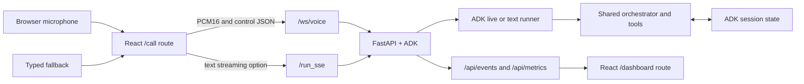

# Claim Assist — Frontend and Voice Plan

This is the detailed implementation plan for the caller frontend, live voice
channel, and manager dashboard. It expands the channel portion of the
[Overall Plan](overall_plan.md).

## 1. Scope

The frontend must support two audiences without creating separate backends:

- `/call` provides live voice, typed fallback, transcripts, grounded result
  cards, Claim Readiness and notification previews, and clear escalation or ROI
  messaging.
- `/dashboard` provides Sentinel alerts, calculated metrics, and evidence from
  completed interactions.

The existing static page at `/demo` remains available as the fallback voice
client. It is also the reference for the React audio implementation.

## 2. Current baseline

| Capability | Current state |
|---|---|
| FastAPI application | `backend/main.py` mounts ADK endpoints, the voice router, and `/demo`. |
| Text agent access | ADK provides `/run`, `/run_sse`, session CRUD, and the development UI. |
| Voice transport | `/ws/voice` accepts browser PCM audio or typed JSON and returns PCM audio, transcripts, interruption, and turn-complete messages. |
| Audio client | `backend/static/index.html` captures microphone audio, downsamples to 16 kHz PCM16, plays 24 kHz PCM16, and stops playback on interruption. |
| Voice agent | The live orchestrator calls deterministic claim-story lookup and narrates only returned facts. |
| React application | Not yet created. |
| Structured call cards | Planned. The current voice socket carries audio and transcript/control messages, not claim, benefit, ROI, or readiness card payloads. |
| Dashboard APIs | Planned. Sentinel can produce a snapshot but is not mounted into the FastAPI runtime. |

## 3. Target channel architecture



Voice and text use the same domain tools and session contract. The channel may
use a different model and transport, but it must not contain separate claim,
benefit, ROI, or escalation logic.

## 4. Routes and user experience

### `/call`

The call screen should include:

- start and end call controls
- clear microphone permission guidance
- connection and agent state indicator
- live caller and agent transcripts
- typed input that uses the same active session
- claim-story card with status, timeline, denial details, required action,
  estimate, confidence/escalation state, and grounding
- benefit card with coverage, prior authorization, cost explanation, next step,
  provider choices, language, and grounding
- Claim Readiness card with eligibility, risk band, reviewed evidence,
  recommended action, data completeness, and grounding
- synthetic notification preview clearly marked as not sent
- clarification choices when a service phrase maps to multiple CPT codes
- explicit ROI and human-escalation states

Suggested call states:

`idle → connecting → listening → thinking → speaking → listening`

Terminal or exceptional states:

`ended`, `permission_denied`, `disconnected`, `error`, and `escalated`.

The transcript is a conversational aid, not the source of structured facts.
Claim and benefit cards should render typed backend payloads.

### `/dashboard`

The manager screen should include:

- metric tiles for AHT, FCR, repeat contacts, escalations, at-risk claims
  identified, and corrective interventions recorded
- baseline and current values with labeled assumptions
- active alert feed sorted by severity and recency
- alert evidence, occurrence count, window, and recommended action
- filters for alert type, severity, member, claim, and time window where the
  data supports them
- a visible empty state before the demo creates events

Polling every few seconds is sufficient for the hackathon. WebSocket or SSE
push for the dashboard can be deferred.

## 5. Voice WebSocket contract

Endpoint: `GET /ws/voice` upgraded to WebSocket.

### Browser to server

| Frame | Current/planned | Meaning |
|---|---|---|
| Binary | Current | Raw signed 16-bit PCM, mono, 16 kHz microphone audio. |
| `{"type":"text","text":"..."}` | Current | Typed fallback input in the active live session. |
| `{"type":"end_turn"}` | Optional | Explicitly ends typed or push-to-talk input if the final UX needs it. |

### Server to browser

| Frame | Current/planned | Meaning |
|---|---|---|
| Binary | Current | Raw signed 16-bit PCM, mono, 24 kHz agent audio. |
| `{"type":"user_transcript","text":"..."}` | Current | Live caller transcript fragment. |
| `{"type":"agent_transcript","text":"..."}` | Current | Live agent transcript fragment. |
| `{"type":"interrupted"}` | Current | Caller barged in; stop queued playback immediately. |
| `{"type":"turn_complete"}` | Current | Agent completed the current turn. |
| `{"type":"session_started","session_id":"..."}` | Planned | Gives the frontend a correlation key for structured results and operational events. |
| `{"type":"domain_result","capability":"claim_story\|benefits_qa\|claim_readiness","result":{...}}` | Stretch | Carries a validated card payload without requiring the UI to parse the transcript. Prefer the session-summary endpoint first. |
| `{"type":"error","code":"...","message":"..."}` | Planned | Provides a typed, user-safe channel error. |

If ADK session events make `domain_result` awkward to emit directly from the
voice loop, expose a read-only session-summary endpoint keyed by the emitted
`session_id`. The UI contract should remain the same regardless of transport.

## 6. Text channel

Use `/run_sse` for a streaming text-only experience or as a voice fallback.
Text and voice must:

- use the same session-state keys
- use the same orchestrator and domain tools
- produce the same structured claim, benefit, ROI, and readiness result models
- apply the same ROI and confidence behavior
- publish the same operational events

The text channel uses the configured text model. The voice channel uses the
audio-native live model and location configured specifically for that runner.

Current project configuration:

| Use | Model | Location |
|---|---|---|
| Text | `gemini-3.5-flash` | `us` |
| Live voice | `gemini-live-2.5-flash-native-audio` | `us-central1` |
| Text fallback | `gemini-2.5-flash` | `us-central1` |

Keep these values in settings; do not hardcode them in React or agent
instructions.

## 7. Backend additions

The existing ADK and voice endpoints should remain. Add:

| Endpoint | Purpose |
|---|---|
| `GET /api/events` | Returns recent normalized events for the dashboard and demo trace. |
| `GET /api/metrics` | Returns the current Sentinel metrics snapshot and labeled baseline. |
| `GET /api/alerts` | Returns active alerts ordered by severity and recency, or combine this with `/api/events` if the response remains clear. |
| `GET /api/sessions/{session_id}/summary` | Optional projection of structured session findings when they are not pushed over the voice socket. |

Implementation requirements:

- create the shared event log and Sentinel once during application startup
- stop Sentinel cleanly during application shutdown
- return Pydantic response models rather than ad hoc dictionaries
- keep all operational endpoints read-only for the demo
- never expose raw credentials, prompts, or unrestricted member records
- configure frontend origins instead of retaining `allow_origins=["*"]` for a
  production deployment

## 8. Suggested frontend structure

```text
src/frontend/
├── package.json
├── vite.config.ts
├── src/
│   ├── app/
│   │   ├── App.tsx
│   │   └── router.tsx
│   ├── pages/
│   │   ├── CallPage.tsx
│   │   └── DashboardPage.tsx
│   ├── components/
│   │   ├── CallControls.tsx
│   │   ├── ConnectionStatus.tsx
│   │   ├── Transcript.tsx
│   │   ├── ClaimStoryCard.tsx
│   │   ├── BenefitsCard.tsx
│   │   ├── ClaimReadinessCard.tsx
│   │   ├── NotificationPreview.tsx
│   │   ├── ClarificationChoices.tsx
│   │   ├── MetricTile.tsx
│   │   └── AlertFeed.tsx
│   ├── hooks/
│   │   ├── useVoiceSession.ts
│   │   ├── useAudioCapture.ts
│   │   ├── usePcmPlayback.ts
│   │   └── useSentinelSnapshot.ts
│   ├── api/
│   │   ├── voiceProtocol.ts
│   │   ├── agentClient.ts
│   │   └── sentinelClient.ts
│   └── types/
│       ├── claims.ts
│       ├── benefits.ts
│       ├── readiness.ts
│       └── sentinel.ts
└── tests/
```

The audio capture and playback hooks should be thin ports of the working static
demo. Domain components should consume generated or hand-maintained TypeScript
types that match backend Pydantic responses.

## 9. Audio implementation

### Capture

1. Request a mono microphone stream with echo cancellation and noise
   suppression.
2. Capture samples through an `AudioWorklet`.
3. Downsample from the browser context rate to 16 kHz.
4. Clamp float samples and encode signed PCM16 little-endian.
5. Send binary chunks only while the WebSocket is open.

### Playback

1. Interpret binary server frames as signed PCM16.
2. Convert samples to browser audio buffers at 24 kHz.
3. Schedule buffers consecutively to avoid gaps and overlap.
4. Track active sources.
5. Stop all queued and playing sources when `interrupted` arrives or the call
   ends.

### Cleanup

Ending a call must close the WebSocket, stop media tracks, close audio contexts,
clear queued playback, reset transcript aggregation, and return controls to the
idle state.

## 10. Structured result rendering

### Claim Story card

Render:

- claim ID and current status
- member-friendly summary
- provider, service, billed amount, and paid amount
- ordered timeline
- denial code and reason when applicable
- whether the denial is fixable
- required action and estimated reprocessing time
- confidence and escalation requirement
- grounding table, record, and fields

When escalation is required, prioritize the handoff message over incomplete
details.

### Benefits card

Render:

- resolved, ambiguous, ROI-blocked, or unsupported state
- covered/not-covered result
- prior-authorization requirement
- cost estimate text and why a dollar total may not be available
- next step
- eligible providers without invented distance
- source rule IDs and data source
- clarification choices as buttons when ambiguous

Never display a not-covered service as `$0`, and never calculate a total from
copay plus coinsurance without an allowed amount.

### Claim Readiness card

Render:

- claim ID and screening eligibility
- rules-based risk band
- reviewed risk or readiness factors
- exact source-field evidence
- recommended corrective action
- data completeness
- grounding record

Do not present the risk band as a probability. Do not count
`denial_risk_flag` separately from missing required prior authorization when
both express the same supplied-data condition.

### Notification preview

Render:

- intended audience
- message content
- claim reference
- recommended action
- `preview` and `not_sent` status

The UI must not imply that an SMS, email, portal message, or provider task was
actually delivered.

## 11. Error and fallback behavior

| Failure | User experience |
|---|---|
| Microphone permission denied | Keep typed input available and explain how to retry permission. |
| WebSocket cannot connect | Offer text mode and show a concise server-availability message. |
| WebSocket disconnects mid-call | Stop playback, preserve the transcript, and offer reconnect or text continuation. |
| Live model unavailable | Use the text flow or the scripted golden-path fallback. |
| Claim not found | Ask the caller to verify the claim ID. |
| Claim data below confidence threshold | Explain that a claims specialist must review it and provide the escalation path. |
| Claim is not Pending or In Review | Mark readiness screening as ineligible without changing the Claim Story result. |
| Readiness data is incomplete | Show the available evidence and decline to assign an unsupported risk band. |
| Benefit phrase ambiguous | Render choices rather than selecting a CPT code silently. |
| ROI missing or expired | Explain the authorization requirement without revealing member-specific details. |
| BigQuery unavailable for benefits | Use the existing CSV fallback and label the result source. |
| Dashboard has no events | Show a clear baseline/empty state instead of zeroes that look like measured outcomes. |

## 12. Implementation sequence

This is the P2 presentation-layer sequence from the
[Overall Plan](overall_plan.md). Begin it only after the backend critical path
has a stable fallback demonstration. Each step is independently stoppable; keep
the existing `/demo` and Streamlit surfaces for anything not yet ported.

### Step 1 — React foundation

- scaffold Vite, TypeScript, routing, linting, and tests
- create `/call` and `/dashboard`
- configure a local backend proxy and environment-based API base URL

### Step 2 — Voice client parity

- port the static demo's microphone, PCM, transcript, typed input, playback, and
  interruption logic
- add stateful call controls and cleanup
- verify voice and typed input in one session

### Step 3 — Structured session results

- emit `session_started`
- consume the session-summary endpoint; add `domain_result` only if needed
- implement claim, benefit, ROI, and readiness cards
- implement the notification preview
- implement clarification, ROI, and escalation views

### Step 4 — Sentinel runtime APIs

- wire application-scoped EventLog/Sentinel lifecycle
- expose events, alerts, and metric snapshots
- add typed API clients and polling

### Step 5 — Manager dashboard

- render metric tiles, baseline assumptions, alert feed, evidence, and filters
- label the proactive metric as corrective interventions recorded
- verify that a completed call updates the dashboard

### Step 6 — Hardening

- test browser cleanup, reconnect, interruption, and denied microphone access
- add responsive and accessible states
- add model/data health checks
- preserve `/demo` and scripted text fallback
- run the golden path repeatedly in the intended presentation environment

## 13. Acceptance criteria

The frontend and voice portion is complete when:

- `/call` works with voice and typed input in the same session
- the caller hears audio and sees both sides of the transcript
- caller interruption immediately stops queued agent audio
- claim, benefit, ROI, and readiness facts appear as structured cards rather
  than transcript parsing
- notification content is visibly marked as a preview that was not sent
- ROI, ambiguity, low confidence, and not-found paths are visibly safe
- `/dashboard` reflects events from the completed interaction
- metric values are calculated and baseline assumptions are labeled
- the static `/demo` fallback still works
- no real PHI, secrets, or ungrounded facts appear in the UI

## 14. Production channel path

For production telephony, replace the browser adapter with a Twilio Media
Streams adapter:

1. Twilio answers the PSTN call and streams 8 kHz mu-law audio.
2. The adapter decodes and resamples audio to the live runner's expected PCM
   format.
3. Agent audio is transcoded back to the telephony format.
4. Session, ROI, claim, benefit, readiness, event, and Sentinel logic remain
   unchanged.

Keeping channel conversion at the edge is what allows the hackathon browser
experience to evolve into a call-center integration without rewriting the
domain agents.
