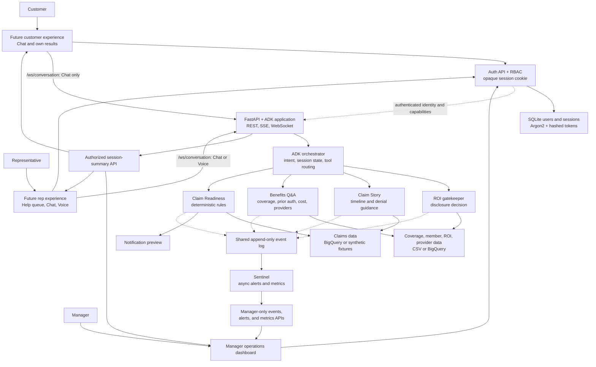

# Claim Assist — Overall Plan

Claim Assist is a multi-agent member and claims intelligence system built with
Google Agent Development Kit (ADK). It helps members and representatives
understand claims, verify whether information may be disclosed, answer benefit
questions, identify actionable claim-readiness risks, and surface operational
signals before every issue requires a human call.

This document is the single source of truth for product scope, architecture,
channel contracts, feature priority, implementation order, demo flow, and
future additions.

## Implementation status at a glance

Use this table as the quick starting point before selecting the next roadmap
feature. Status reflects the current repository, not the target architecture.

| Area | Status | Implemented now | Work remaining | Roadmap |
|---|---|---|---|---|
| FastAPI and ADK platform | **Implemented through P1** | ADK UI, `/run`, `/run_sse`, session endpoints, `/ws/conversation`, `/ws/voice`, `/demo`, `/operations`, auth APIs, and the summary/operations APIs are mounted; lifecycle, authentication, and route behavior are verified. | Durable ADK/session persistence and distributed deployment remain future work. | Foundation; Features 0, 6, 9–10 |
| Authentication and role access | **Hackathon backend implemented** | SQLite users, Argon2 password hashes, opaque hashed sessions, tracked schema/demo seeds, login/me/logout APIs, allowed-origin checks, HTTP/WebSocket RBAC, role capabilities, ADK identity propagation, and summary ownership are verified. | Login and role-specific pages are Feature 12; enterprise identity, MFA, recovery, rate limiting, managed secrets, and durable audit retention remain future work. | Feature 0; Feature 12 UI |
| Chat and live voice | **Backend implemented with role gates** | Authenticated customers and reps use `/ws/conversation`; customers are chat-only, while reps can switch between Chat and Voice in one session. `/ws/voice` and the current `/demo` adapter are rep-only. Continuous browser audio, interruption handling, spoken replies, validated text/mode input, session correlation, summary-aware turn completion, and typed safe errors are wired to the shared root-agent factory. | The separate frontend must render customer chat and rep chat/call experiences. A credentialed microphone-to-live-model call remains an environment check; structured result cards are later UI work. | Features 0, 6, 8, 12 |
| Claim Story | **Implemented and integrated** | Exact BigQuery lookup with synthetic CSV fallback, deterministic timeline and denial guidance, grounding, confidence handling, escalation, shared findings, ROI enforcement, and typed denial/escalation events are verified. | Population-wide analysis and production data operations remain future work. | Features 3–5, 9 |
| Benefits Q&A | **Implemented and integrated** | Deterministic coverage, prior authorization, cost, provider guidance, CSV/BigQuery clients, ambiguity handling, ROI refusal, shared findings, typed operational events, orchestrator routing, and summary projection are verified. | Production directory freshness and data-source operations remain future work. | Features 4, 6, 9 |
| ROI controls | **Implemented and integrated** | One shared session context resolves verified, not-required, missing, expired, and unknown ROI; all member-specific tools fail closed, findings project through the summary API, and ROI-gap/session-start events feed Sentinel. | Production identity proofing and authorization submission remain future work. | Features 3, 6, 9 |
| Shared orchestrator | **Implemented through P1 integration** | The root agent routes ROI, Claim Story, Benefits Q&A, provider guidance, Claim Readiness, and grounded corrective-intervention recording while preserving language, intent history, structured findings, and operational events across turns. | Production channel integration and durable cross-instance session state remain future work. | Features 2–9 |
| Claim Readiness | **Implemented and integrated** | Validated deterministic screening, eligibility and completeness handling, ROI enforcement, shared findings, typed risk/recommendation events, grounded unsent previews, corrective-intervention recording, and focused tests are complete. | Population scanning and additional reviewed rules remain stretch or future work. | Features 1–2, 5, 8–9 |
| Prevention events | **Implemented and integrated** | Readiness risk, intervention recommendation, and intervention recording use typed evidence payloads in the shared append-only log. | Durable external event streaming remains future work. | Feature 5 |
| Structured session-summary API | **Implemented and authorized** | `GET /api/sessions/{session_id}/summary` returns validated ROI, claim, benefits, readiness, and preview findings with incomplete-session behavior. Customers can retrieve only their own sessions; reps and managers may retrieve any current in-process summary. | Persistent distributed session storage and narrower rep queue projections remain future work. | Features 0, 6, 12 |
| Metrics methodology | **Implemented for demo population** | Sentinel calculates documented AHT, FCR, repeat contacts, escalation, ROI gaps, at-risk claims, and correlated corrective interventions against labeled synthetic assumptions. | Production baselines and outcome evaluation remain future work. | Feature 7 |
| Notification preview | **Implemented** | At-risk readiness results produce a grounded portal-message preview labeled `preview` and `not_sent`, visible on the operations page. | Real outbound delivery remains future work. | Feature 8 |
| Sentinel runtime | **Implemented and integrated** | One application-scoped event log and Sentinel lifecycle consume live specialist/session events and expose events, alerts, and metrics APIs. | Durable distributed runtime remains future work. | Feature 9 |
| Operations dashboard | **Implemented and manager-only** | `/operations` displays the labeled baseline, all planned demo metrics, active alerts, evidence IDs, recommended actions, and empty state; the page and operational APIs require the manager role. | Advanced filters and push updates remain stretch work. | Features 0, 10 |
| Expanded golden path | **Implemented with deterministic fallback** | A fixed-ID API/dashboard trigger assembles ROI, denied Claim Story, Benefits, readiness, notification preview, recorded intervention, events, alerts, and metric update; a rendered screenshot backup is stored in `assets/images/`. | Live microphone/model access remains an environment check. | Feature 11 |
| Role-specific frontend | **Separate workstream** | The backend returns `manager_dashboard`, `chat`, `rep_queue`, and `voice` capabilities and enforces them server-side. The static `/demo` page remains only a rep voice/audio reference. | Build login plus customer chat-only, rep queue/chat/call, and manager dashboard pages without moving domain or authorization logic into the browser. A dedicated rep help-queue projection/API is still required. | Feature 12 |

Current verified backend checkpoint: **135 tests passed, 3 skipped, and 216
subtests passed**. At user direction, this checkpoint was verified through
terminal tests, FastAPI/application smoke checks, an isolated repeatable auth
bootstrap, the historical Sentinel replay, and a real-browser golden-path
dashboard exercise while the frontend is being implemented separately.

## 1. Target outcome

The complete hackathon demo should show one grounded workflow:

1. Authenticate as a customer, representative, or manager and expose only the
   capabilities assigned to that role.
2. As a customer, start in Chat; as a representative, start in Chat or
   explicitly choose Voice and switch modes without losing the session.
3. Establish caller identity, subject member, and session context.
4. Apply Release of Information (ROI) controls when the caller represents
   another adult member.
5. Explain an existing claim in plain language.
6. Answer a related coverage, prior-authorization, or cost-sharing question.
7. Inspect a Pending or In Review claim for reviewed readiness risks.
8. Recommend and record a corrective intervention.
9. As a manager, show the resulting events, alerts, and calculated demo metrics.

The business story is a shift from reactive explanation toward proactive,
trusted self-service:

- less manual claim interpretation
- clearer member and provider next steps
- safer disclosure
- fewer avoidable repeat contacts
- earlier intervention on actionable claim requirements
- earlier visibility into operational and compliance patterns

## 2. Scope and implementation rules

### Independent feature rule

The roadmap is deliberately incremental. Every numbered feature must:

- have a narrow responsibility
- declare its dependencies
- produce a usable output on its own
- include focused tests or a deterministic verification
- preserve all previously working behavior
- end with a documented safe stopping point

If time runs out after any feature, the team should be able to stop, run the
tests, and demonstrate everything completed through that feature. A later
feature may improve integration or presentation, but it must not be required to
make an earlier feature truthful.

### Priority levels

| Priority | Meaning |
|---|---|
| **P0 — Critical path** | Implement in order. These features create the strongest rubric-aligned, end-to-end story. |
| **P1 — High-value integration** | Implement after the P0 checkpoint is stable. These improve operational visibility and presentation. |
| **P2 — Stretch** | Implement only if the complete fallback demo remains reliable. |
| **Future** | Present as the enterprise path; do not attempt during the hackathon. |

### Honest prototype language

The hackathon implementation may use deterministic rules and synthetic data,
but it must be labeled accurately:

- Say **Claim Readiness screen** or **rules-based denial-risk screen**.
- Do not call the screen a trained predictive model.
- Say **corrective intervention recorded**, not **denial prevented**, unless a
  later simulated adjudication outcome proves that relationship.
- Treat baseline business metrics as labeled assumptions, not historical Humana
  results.
- Treat notification content as a preview unless it is actually delivered by an
  integrated channel.

## 3. Stakeholders and workflow value

| Stakeholder | Current pain | Claim Assist intervention | Demonstrated outcome |
|---|---|---|---|
| Member or authorized caller | Cannot understand claim status or next action | Plain-language claim story and benefit guidance | Clearer self-service path and next step |
| Member-services representative | Manually interprets codes and searches multiple systems | Structured claim, benefit, ROI, and readiness results | Reduced lookup and explanation effort |
| Provider office | Learns about missing requirements after denial | Claim-readiness warning and notification preview | Corrective action can begin before final adjudication |
| Supervisor | Handles avoidable escalations and repeat contacts | Confidence-based handoff with consolidated evidence | Escalations include a defined reason and source data |
| Compliance and operations | Sees patterns after member impact | Sentinel alerts with evidence and recommended action | Earlier visibility into ROI, denial, and workflow gaps |

## 4. Product surfaces

Claim Assist targets three role-specific user-facing surfaces:

- **Customer experience:** Chat only, plus the customer's own claim stories,
  benefit answers, ROI guidance, readiness results, notification previews, and
  safe escalation.
- **Representative experience:** a future queue of customers who need help,
  plus Chat and Voice participation, structured results, and authorized access
  to session summaries needed to assist callers.
- **Operations/manager experience:** manager-only alerts and metrics for denial
  patterns, ROI gaps, repeat contacts, escalations, at-risk claims identified,
  and corrective interventions recorded.

The current rep-only static browser-microphone page at `/demo` is the required
low-dependency audio fallback. Authentication currently exposes an API contract,
not a login page. The full login, customer, rep, and manager frontend is a
separate workstream against the contracts in this document; it is not a
prerequisite for the backend domain workflow.

## 5. Architecture

### Architectural responsibilities

| Layer | Responsibility |
|---|---|
| Frontend | Authenticates through the backend, presents only role-appropriate navigation and capabilities, and renders conversation and structured results; never determines authorization, claim, coverage, ROI, or readiness facts. |
| Authentication and RBAC | Verifies local demo credentials, owns opaque sessions, maps users to capabilities, protects HTTP/WebSocket routes, and supplies authenticated identity to ADK state. |
| FastAPI/ADK application | Hosts authenticated text endpoints, the role-gated conversation WebSockets, authorized operational/summary APIs, and the rep-only fallback demo. |
| Orchestrator | Owns the conversation, establishes session state, enforces ROI, and invokes deterministic specialist tools while retaining control. |
| Claim Story | Builds a grounded lifecycle and denial explanation for one exact claim. |
| Benefits Q&A | Builds deterministic coverage, prior-authorization, cost, and provider guidance. |
| Claim Readiness | Applies reviewed rules to one Pending or In Review claim and explains actionable evidence. |
| Data clients | Hide CSV and BigQuery implementations behind stable interfaces. |
| Event log and Sentinel | Keep monitoring outside the request path and convert structured events into alerts and metrics. |

## 6. Implementation baseline

The repository already contains working backend components. New work must build
on them rather than redesigning them. The status table at the top of this
document is the maintained source of truth for completed and remaining work.

## 7. Domain capabilities

### 7.1 Claim Story

For one exact claim ID:

- fetch and validate the claim
- produce a member-readable timeline
- explain known denial codes using reviewed guidance
- preserve required actions and reprocessing estimates
- return grounding references
- escalate unsupported or incomplete records

### 7.2 Benefits Q&A

For one member and service:

- resolve a CPT code or supported phrase
- answer whether the service is covered
- state prior-authorization requirements
- explain available cost-sharing facts without inventing a dollar total
- return provider guidance where supported
- ask for clarification when the phrase is ambiguous
- fail closed when ROI does not permit member-specific detail

### 7.3 ROI Gatekeeper

For each session involving another adult member:

- compare caller and subject member
- resolve ROI as `verified`, `not_required`, `missing`, or `expired`
- block member-specific detail for missing, expired, or unknown status
- provide the approved self-service authorization next step
- emit an ROI-gap event without disclosing restricted information

### 7.4 Claim Readiness

For one Pending or In Review claim:

- determine whether the claim is eligible for readiness screening
- apply reviewed deterministic rules
- return a risk band, exact evidence, recommended action, and grounding
- generate a synthetic notification preview
- emit readiness and intervention events

Initial hackathon rules:

| Signal | Treatment |
|---|---|
| Required prior authorization is missing | Demonstrated high-risk, actionable condition |
| Referral is missing | Workflow-readiness warning unless a reviewed service rule requires it |
| `denial_risk_flag` | Do not count separately; it duplicates missing required prior authorization in the supplied data |
| Modifier mismatch | Supported by the schema, but not demonstrated on current Pending/In Review data |
| Diagnosis/CPT mismatch | Do not infer without a reviewed compatibility table |

The readiness `risk_band` is a rules classification, not a probability.
`data_completeness` describes input completeness, not predictive confidence.

### 7.5 Sentinel

Sentinel consumes events asynchronously and may surface:

- denial spikes
- ROI-gap frequency
- repeat contacts
- escalations
- compliance flags
- claim-readiness events encountered in the demo
- corrective interventions recorded

Population-wide scanning of all pending claims is a stretch feature because the
current claims repository retrieves one exact claim at a time.

## 8. Shared contracts

### Authentication and role access

The implemented hackathon identity provider is local SQLite authentication.
Passwords are stored as Argon2 hashes. Successful login creates an opaque
random session token; only its SHA-256 hash is stored in SQLite. The browser
receives the raw token in an eight-hour `HttpOnly`, `SameSite=Lax` cookie that
is marked `Secure` when configured for deployment.

The runtime database at `backend/.data/auth.sqlite3` is intentionally local
because logins mutate its session table. The reproducible schema and synthetic
demo accounts are tracked in `backend/src/auth/schema.sql` and
`backend/src/auth/demo_seed.sql`. `uv run python -m src.auth.bootstrap` applies
both idempotently when `AUTH_ENABLE_DEMO_SEED=true`.

Auth API contract:

| Endpoint | Access | Behavior |
|---|---|---|
| `POST /api/auth/login` | Public, allowed origins only | Verifies username/password, sets the session cookie, and returns the public user plus capabilities. |
| `GET /api/auth/me` | Authenticated | Returns `{id, username, role, capabilities}` for frontend routing. |
| `POST /api/auth/logout` | Authenticated | Revokes the stored session and clears the cookie. |

Role and server-enforced capability contract:

| Role | Capabilities | Current access | Future surface |
|---|---|---|---|
| `manager` | `manager_dashboard` | `/operations`, operational APIs, OpenAPI/docs, and raw ADK developer/session/run endpoints | Manager dashboard only |
| `customer` | `chat` | Text-only `/ws/conversation` and summaries owned by the authenticated customer | Customer chat page only |
| `rep` | `rep_queue`, `chat`, `voice` | `/demo`, `/ws/conversation`, `/ws/voice`, and current in-process summaries | Help queue plus Chat and Call |

HTTP APIs return `401` for absent, invalid, or expired sessions and `403` for
insufficient permissions. WebSockets fail before acceptance with close code
`4401` or `4403`. Browser origins must match `AUTH_ALLOWED_ORIGINS`. Hiding a
page or control in the frontend is never treated as authorization.

### Session state

ADK session state is the shared contract. Pydantic models validate structured
values.

| Key | Purpose |
|---|---|
| `session_id` | Correlates conversation, events, metrics, and UI state. |
| `auth_user_id` | Associates the ADK conversation and summary with the authenticated backend user. |
| `auth_role` | Records the authenticated `customer` or `rep` role used to authorize the conversation. |
| caller identity / `caller_name` | Identifies who is requesting information. |
| `subject_member_id` | Identifies whose information is in scope. |
| `roi_status` | Controls member-specific disclosure. |
| `language` | Preferred response language. |
| `intent_history` | Records routed intents. |
| `agent_findings` | Stores structured claim, benefit, ROI, and readiness results. |
| timing and outcome fields | Supports session metrics and intervention tracking. |

### Chat and Voice conversation channel

The implemented conversation endpoint is authenticated `WS /ws/conversation`.
Customers and reps may connect, but customers are locked to Chat. Reps may use
Chat or Voice, and the backward-compatible `WS /ws/voice` route is rep-only.
Each accepted socket creates one ADK session under the authenticated user ID
and begins in `chat` mode. For reps, a mode change does not create a new
session, so caller identity, ROI status, intent history, and structured
specialist findings remain available.

The separate customer frontend exposes Chat only. The rep frontend initially
selects Chat and must not request microphone permission, send microphone
frames, or play spoken audio until the rep explicitly selects Voice. Switching
back to Chat must stop microphone capture and queued playback while leaving the
socket and session active.

#### Browser-to-server frames

| Frame | Status | Meaning |
|---|---|---|
| `{"type":"text","text":"..."}` | Implemented | Sends validated typed input in either mode. Text is trimmed, must be non-empty, and is limited to 4,000 characters. |
| `{"type":"set_mode","mode":"chat"}` | Implemented | Selects text-only presentation without resetting the session. |
| `{"type":"set_mode","mode":"voice"}` | Implemented for reps | Enables microphone input and spoken-response frames for the same rep session. Customers receive `voice_forbidden` and remain in Chat. |
| Binary | Implemented for reps in Voice only | Raw signed PCM16 little-endian, mono, 16 kHz microphone audio. Audio sent while Chat is active is rejected with `voice_mode_required` for reps or `voice_forbidden` for customers. |
| `{"type":"end_turn"}` | Deferred | Not used while the live model uses automatic activity detection. Add only with an explicitly configured push-to-talk flow. |

#### Server-to-browser frames

| Frame | Meaning |
|---|---|
| `session_started` | Announces `session_id`, initial `mode: "chat"`, `summary_url`, and the input/output audio formats before the first turn. |
| `mode_changed` | Confirms the active `chat` or `voice` mode. |
| Binary | Raw signed PCM16 little-endian, mono, 24 kHz agent audio; emitted only in Voice mode. |
| `user_transcript` | Caller transcript fragment produced by live audio transcription. |
| `agent_transcript` | Agent response transcript fragment; this is the visible response in Chat mode. |
| `interrupted` | Indicates caller barge-in; the frontend must immediately stop queued playback. |
| `turn_complete` | Marks the end of a response and repeats `session_id` plus `summary_url` so structured cards can refresh. |
| `error` | Returns a user-safe code, message, and retryable flag. Implemented codes are `invalid_message`, `voice_forbidden`, `voice_mode_required`, `session_initialization_failed`, and `live_model_unavailable`; exception details are never sent to the browser. |

The conversation runner uses the configured audio-native live model and keeps
the same deterministic orchestrator tools in both modes. Chat suppresses audio
frames and renders the agent transcript; rep Voice forwards the same transcript
plus spoken audio. The existing `/run` and `/run_sse` endpoints remain
available as manager-only ADK developer channels, not customer or rep product
APIs.

Structured claim, benefit, ROI, readiness, and notification facts are not
duplicated into WebSocket `domain_result` messages. The frontend uses the
emitted `summary_url` and `GET /api/sessions/{session_id}/summary`; an
incomplete summary exists as soon as `session_started` is emitted. Add direct
domain-result frames only if measured latency proves the summary fetch is
insufficient. Customers may fetch only summaries whose `auth_user_id` matches
their account; reps and managers may fetch any current in-process summary.

Current channel configuration:

| Use | Model setting | Location setting |
|---|---|---|
| Standalone text endpoints | `MODEL_NAME` (`gemini-3.5-flash` default) | `GOOGLE_CLOUD_LOCATION` (`us` default) |
| Chat / Voice conversation socket | `LIVE_MODEL_NAME` (`gemini-live-2.5-flash-native-audio` default) | `LIVE_MODEL_LOCATION` (`us-central1` default) |
| Voice | `LIVE_VOICE_NAME` (`Aoede` default) | Uses the live-model location |

The live channel publishes `session_started` and `session_completed` events
with conversation metadata. Session completion conservatively does not infer
resolution, repeat contact, or human escalation merely from socket closure.
The rep-only static `/demo` page remains a small voice-only reference: its
existing Start call action explicitly sends `set_mode: "voice"`. It is not the
final customer Chat or rep Chat / Voice frontend.

Voice clients must request mono audio with echo cancellation and noise
suppression, capture through an `AudioWorklet`, downsample to 16 kHz, and encode
signed PCM16 little-endian frames. Playback must decode 24 kHz PCM16, schedule
buffers without overlap or gaps, track active sources, and stop all queued
audio on `interrupted`, mode change to Chat, disconnect, or session end.

Implementation references:

- `backend/src/api/voice.py` — conversation route, session lifecycle, mode
  gating, ADK live runner pumps, summaries, and safe failures
- `backend/src/auth/` and `backend/src/api/auth.py` — users, sessions,
  capability mapping, bootstrap, HTTP/WebSocket guards, and auth APIs
- `backend/src/models/voice.py` — validated client and server frame contracts
- `backend/tests/test_voice_api.py` — Chat default, bidirectional mode switching,
  audio gating, transcript delivery, summary correlation, and failure tests
- `backend/static/index.html` — minimal legacy voice adapter only

### Events

Expected event types:

- `session_started`
- `session_completed`
- `denial_explained`
- `roi_gap_detected`
- `coverage_question_answered`
- `network_gap_detected`
- `denial_risk_detected`
- `intervention_recommended`
- `intervention_recorded`
- `escalation_triggered`
- `compliance_flag_detected`

Readiness and intervention events must include:

- session ID
- claim ID and member ID
- rule identifier
- evidence fields
- recommended action
- event source
- synthetic/demo label

## 9. Grounding, safety, and reliability

- All demo records are synthetic; no real PHI is stored or displayed.
- Authentication and role checks are enforced by HTTP/WebSocket backend guards,
  never only through hidden frontend navigation.
- Passwords use Argon2 hashes, session tokens are stored only as SHA-256 hashes,
  and passwords, cookies, and raw tokens are excluded from logs.
- Demo credentials and the SQLite provider are hackathon-only; they are not an
  enterprise healthcare identity system.
- The model does not invent claim facts, denial reasons, readiness factors,
  coverage rules, cost amounts, provider availability, or timelines.
- Every member-facing result identifies its grounding record or source.
- ROI fails closed.
- Low-confidence or incomplete claim stories escalate rather than guess.
- Benefit ambiguity produces choices rather than a silent match.
- Readiness results use reviewed rules and exact evidence.
- Duplicate data fields are not double-counted as independent signals.
- Sentinel remains asynchronous and cannot block the caller response.
- CSV-backed benefits remain available if BigQuery is unavailable, and the
  result reports its data source.
- Every live-model workflow has a deterministic or typed fallback.

## 10. Prioritized implementation roadmap

Each feature below is an independent checkpoint. Complete and verify one before
starting the next.

### Feature 0 — Role-based authentication foundation

- **Status:** ✅ Complete
- **Priority:** P0
- **Depends on:** FastAPI application entrypoint and the existing HTTP/WebSocket
  routes
- **Purpose:** establish one authenticated identity and server-enforced role
  decision before role-specific pages are added.

Completed deliverables:

- [x] `manager`, `customer`, and `rep` roles with explicit capabilities
- [x] SQLite users and sessions with tracked schema and demo seed SQL
- [x] Argon2 password verification and opaque hashed session tokens
- [x] idempotent `uv run python -m src.auth.bootstrap`
- [x] `POST /api/auth/login`, `GET /api/auth/me`, and
  `POST /api/auth/logout`
- [x] eight-hour `HttpOnly`, `SameSite=Lax`, deployment-configurable `Secure`
  cookie
- [x] allowed-origin enforcement and removal of wildcard CORS
- [x] HTTP and WebSocket `401`/`403` and `4401`/`4403` behavior
- [x] manager-only operations and ADK developer surfaces
- [x] customer chat-only and owned-summary access
- [x] rep Chat/Voice access and authenticated identity in ADK session state
- [x] isolated auth, role-matrix, ownership, origin, bootstrap, and integration
  tests

**Feature complete when:** a seeded user can log in, receive only the declared
capabilities, access only authorized HTTP/WebSocket surfaces, and log out with
the session revoked. **Verified complete.**

**Safe stopping point:** consume the auth APIs directly until the separate
login and role-specific frontend pages are implemented.

### Feature 1 — Standalone Claim Readiness service

- **Status:** ✅ Complete
- **Priority:** P0
- **Depends on:** existing claims model and exact-claim repository
- **Purpose:** create the proactive capability without introducing orchestration
  or UI risk.

Deliverables:

- Pydantic request and result models
- pure readiness service for one exact claim
- eligibility handling for Pending and In Review
- reviewed missing-prior-authorization rule
- optional referral readiness warning
- grounding and data-completeness fields
- high, clear, ineligible, and incomplete-result tests
- test proving `denial_risk_flag` is not double-counted

**Feature complete when:** a direct Python call returns a deterministic,
validated readiness result for a known claim and all focused tests pass.

**Safe stopping point:** demo the service through a test, CLI, or JSON output.
No orchestrator, event, Sentinel, or frontend work is required.

### Feature 2 — Readiness tool in the existing orchestrator

- **Status:** ✅ Complete
- **Priority:** P0
- **Depends on:** Feature 1
- **Purpose:** make readiness available through the current text and voice agent
  without redesigning the whole agent topology.

Deliverables:

- direct ADK `FunctionTool` wrapping the readiness service
- orchestrator instructions describing when to call it
- exact-claim confirmation behavior
- structured result written to session state
- tests for tool wiring, state output, and grounded narration constraints

**Feature complete when:** the existing root agent can answer a readiness
question for one exact claim and the standalone Feature 1 API still works.

**Safe stopping point:** demonstrate Claim Story plus Claim Readiness through the
existing ADK or `/demo` surface. Benefits and unified ROI may remain standalone.

### Feature 3 — Shared session context and ROI gate

- **Status:** ✅ Complete
- **Priority:** P0
- **Depends on:** existing member and ROI data; does not require Feature 2
- **Purpose:** establish one safe disclosure decision for every specialist.

Deliverables:

- shared session-state helpers
- caller-versus-subject-member logic
- valid, missing, expired, not-required, and unknown ROI behavior
- ROI result stored in session state
- `session_started` and `roi_gap_detected` events
- focused fail-closed tests

**Feature complete when:** all member-specific tools read the same ROI state and
restricted information is blocked consistently.

**Safe stopping point:** demonstrate the ROI decision and approved next step,
even if Benefits and Readiness are invoked separately.

### Feature 4 — Unified Claim and Benefits orchestration

- **Status:** ✅ Complete
- **Priority:** P0
- **Depends on:** Feature 3 and the existing Claim Story and Benefits modules
- **Purpose:** support a safe multi-intent conversation.

Deliverables:

- attach Benefits Q&A as a tool while the orchestrator retains control
- route claim, benefit, and clarification intents
- preserve caller, member, ROI, language, and findings across turns
- standardize not-found, ambiguity, escalation, and ROI responses
- tests for a claim question followed by a benefit question

**Feature complete when:** one session can safely move from a claim explanation
to a benefit answer without losing context or grounding.

**Safe stopping point:** demo the original three member-facing use cases:
Claim Story, Benefits Q&A, and ROI.

### Feature 5 — Prevention event contracts

- **Status:** ✅ Complete
- **Priority:** P0
- **Depends on:** Feature 1; orchestration is optional
- **Purpose:** make proactive actions observable without claiming causal outcomes.

Deliverables:

- `denial_risk_detected`
- `intervention_recommended`
- `intervention_recorded`
- typed evidence payloads
- event serialization and append-only log tests

**Feature complete when:** a readiness evaluation and a recorded corrective
action produce auditable events for the same claim.

**Safe stopping point:** show the event JSON or replay it through a focused
test. Sentinel integration is not required yet.

### Feature 6 — Structured session-summary API

- **Status:** ✅ Complete
- **Priority:** P0
- **Depends on:** session state from Features 2–4, but may initially expose only
  the findings that exist
- **Purpose:** let any frontend render typed facts instead of parsing transcripts.

Deliverables:

- Pydantic session-summary response
- read-only `GET /api/sessions/{session_id}/summary`
- claim, benefits, ROI, and readiness finding slots
- not-found and incomplete-session behavior
- customer ownership checks with rep/manager cross-session access
- API tests

**Feature complete when:** a caller session can be retrieved as validated JSON.

**Safe stopping point:** use the endpoint directly or render its JSON in the
existing fallback page. WebSocket `domain_result` messages are unnecessary.

### Feature 7 — Metrics methodology and intervention metric

- **Status:** ✅ Complete
- **Priority:** P0
- **Depends on:** existing metrics code and Feature 5 events
- **Purpose:** make the business-value panel transparent and defensible.

Deliverables:

- explicit synthetic `MetricsBaseline`
- documented AHT, FCR, repeat-contact, ROI-gap, and intervention formulas
- replace **Preventable denials caught** with **Corrective interventions
  recorded**
- count an intervention only when the expected readiness and intervention
  events exist for the same claim
- unit tests for each formula and missing-event case

**Feature complete when:** a deterministic event sequence produces a labeled
metrics snapshot with no unsupported causal claim.

**Safe stopping point:** show metrics as JSON, test output, or through the
existing Streamlit renderer.

### Feature 8 — Notification preview

- **Status:** ✅ Complete
- **Priority:** P0
- **Depends on:** Feature 1; Feature 6 is preferred for UI delivery
- **Purpose:** make proactive assistance visible with minimal channel risk.

Deliverables:

- deterministic notification-preview model
- member/provider-safe message assembled from readiness evidence
- clear `preview` and `not_sent` status
- render in `/demo`, Streamlit, or a simple HTML card
- tests proving unsupported facts are not added

**Feature complete when:** an at-risk claim produces a visible, grounded
notification preview.

**Safe stopping point:** demo the preview in the simplest working UI. Real SMS,
email, and portal delivery remain future work.

### Feature 9 — Sentinel runtime integration

- **Status:** ✅ Complete
- **Priority:** P1
- **Depends on:** Feature 5; Feature 7 recommended
- **Purpose:** connect existing monitoring code to live application events.

Deliverables:

- one application-scoped `EventLog` and `SentinelAgent`
- FastAPI startup and shutdown lifecycle
- adapters from claim, benefits, ROI, readiness, and session events
- `GET /api/events`, `GET /api/alerts`, and `GET /api/metrics`
- tests for lifecycle, event consumption, and snapshot responses

Initial scope:

- aggregate readiness events encountered during the demo
- do not scan the entire pending-claims population yet

**Feature complete when:** a live interaction changes the Sentinel snapshot and
the operational APIs expose that change.

**Safe stopping point:** use API JSON or the existing Streamlit dashboard.
A separate frontend dashboard is not required for this checkpoint.

### Feature 10 — Minimal operations dashboard

- **Status:** ✅ Complete
- **Priority:** P1
- **Depends on:** Feature 9
- **Purpose:** make the event and metric story judge-visible.

Deliverables:

- active alerts
- AHT, FCR, repeat contacts, escalation, ROI gaps, at-risk claims identified,
  and corrective interventions recorded
- labeled baseline assumptions
- alert evidence and recommended action
- empty state
- manager-only page and operational API authorization

Use the fastest reliable presentation layer. Enhance the existing Streamlit
renderer before starting a new React dashboard unless React is already stable.

**Feature complete when:** the dashboard can trace displayed values to the demo
event sequence.

**Safe stopping point:** present the Streamlit or simple HTML dashboard.
Advanced filters and real-time push are not required.

### Feature 11 — Expanded golden-path demo

- **Status:** ✅ Complete with deterministic fallback
- **Priority:** P1
- **Depends on:** Features 1–10 as available
- **Purpose:** connect the completed independent features into one persuasive
  story.

Script:

1. Authenticate as a manager and show the labeled baseline.
2. Authenticate as a rep and start a call about a denied claim.
3. Demonstrate ROI handling.
4. Deliver the grounded claim story.
5. Answer the related benefit question.
6. Inspect a separate Pending or In Review claim.
7. Detect missing required prior authorization.
8. Show the notification preview.
9. Record the corrective intervention.
10. Return to the manager view and show the resulting event, alert, and metric
    update.

Reliability requirements:

- fixed synthetic IDs
- reproducible synthetic demo users from the tracked auth seed
- cached or deterministic fallback responses
- Chat mode and typed fallback for Voice
- screenshot or video backup

**Feature complete when:** the script succeeds repeatedly in the presentation
environment and each displayed result can be traced to source data.

**Safe stopping point:** if not all integrations are stable, present completed
features as consecutive deterministic demonstrations rather than pretending
they form one live transaction.

### Feature 12 — Role-specific frontend integration

- **Status:** ⬜ Pending — separate frontend workstream
- **Priority:** P2
- **Depends on:** Feature 0 plus the implemented conversation, session-summary,
  events, alerts, and metrics APIs
- **Purpose:** expose the implemented capabilities through distinct customer,
  representative, and manager experiences without changing domain or
  authorization behavior.

Minimum scope:

- [ ] `/login` using the auth APIs and the returned role/capability contract
- [ ] customer page with Chat only and no voice/call controls
- [ ] rep page with a help-needed queue plus Chat and Call controls
- [ ] manager page with the dashboard only
- [ ] capability-based navigation that still relies on backend enforcement for
  every protected HTTP/WebSocket action
- [ ] dedicated rep help-queue projection/API that does not expose the
  manager-only metrics/dashboard contract
- [ ] `WS /ws/conversation` for customer Chat and rep Chat/Voice without
  replacing the active session
- [ ] no microphone permission request until a rep explicitly selects Voice
- [ ] complete microphone cleanup and audio-queue cancellation when a rep
  returns to Chat or ends the session
- [ ] typed conversation, caller/agent transcripts, rep spoken playback,
  barge-in, and user-safe authentication/disconnection/error states
- [ ] `session_started` and `turn_complete` handling through the emitted
  authorized `summary_url`
- [ ] essential Claim Story, Benefits, ROI, Readiness, and notification cards
  on customer/rep surfaces
- [ ] manager metric tiles and alert list backed only by manager-authorized APIs
- [ ] logout that revokes the backend session and returns to `/login`

The frontend must treat transcripts as conversational aids and use structured
summary responses for factual cards. It must never determine claim, coverage,
ROI, readiness, cost, escalation, or authorization facts. Notification content
must remain visibly labeled `preview` and `not_sent`. A hidden route, button, or
navigation item is presentation only; backend `401`/`403` and `4401`/`4403`
responses remain authoritative.

**Feature complete when:** each seeded role lands on only its intended surface;
customers can Chat but cannot call, reps can see the help queue and use Chat or
Call, managers can see the dashboard, structured cards refresh after turns,
and direct unauthorized route/API/socket attempts remain blocked.

**Safe stopping point:** the frontend is a separate workstream; retain the
rep-only `/demo`, manager-only `/operations`, and direct auth APIs as
backend-owned verification surfaces while it is integrated.

## 11. Stretch features requiring refinement

Implement these only after the full P0 checkpoint is stable:

| Stretch feature | Required refinement |
|---|---|
| Population-wide pending-claim scan | Add a repository list/query method and decide batch timing, deduplication, and alert thresholds. |
| Provider/CPT/risk-factor aggregation | Ensure enough synthetic events exist to make grouping meaningful. |
| Referral-based risk bands | Add reviewed service-specific referral requirements; do not infer from weak correlation. |
| Modifier-based readiness rule | Add or seed eligible synthetic examples before claiming it is demonstrated. |
| Diagnosis/CPT risk | Requires a reviewed compatibility table. |
| WebSocket `domain_result` messages | Implement only if the session-summary endpoint is insufficient. |
| Advanced dashboard filters and live push | Add after core alerts and metrics are stable. |
| Complete responsive and accessible React polish | Do not trade away the complete workflow for surface polish. |

## 12. Metrics methodology

| Metric | Baseline | Prototype value | Interpretation |
|---|---|---|---|
| AHT | Labeled synthetic assumption | Mean duration of completed demo sessions | Demonstrates the calculation path, not a production reduction |
| FCR | Labeled synthetic assumption | Resolved without repeat contact or human escalation | Synthetic workflow outcome |
| Repeat-contact rate | Labeled synthetic assumption | Separate sessions for the same member and claim within the configured window | Event-based detection |
| ROI-gap rate | No production baseline required | Unique ROI-gap sessions divided by observed sessions | Valid for the demo event population |
| At-risk claims identified | Zero in the manual comparison | Eligible claims matching reviewed readiness rules | Rule-match count, not predicted denials |
| Corrective interventions recorded | Zero in the manual comparison | Documented corrective actions linked to readiness events | Does not prove a denial was prevented |

## 13. Presentation and collaboration plan

Replace role placeholders with team names before the final rehearsal:

| Time | Owner | Content |
|---:|---|---|
| 0:00–1:00 | Problem lead | Call-center pain, stakeholders, and target metrics |
| 1:00–2:00 | Architecture lead | Authentication/RBAC, ADK orchestration, deterministic specialists, data boundaries, and Sentinel |
| 2:00–5:00 | Demo lead | Customer/rep access, ROI, Claim Story, Benefits Q&A, Claim Readiness, and notification preview |
| 5:00–6:00 | Operations lead | Manager-only Sentinel alerts, metrics methodology, and evidence trace |
| 6:00–7:00 | Closing lead | Business value, limitations, enterprise path, and questions |

Each owner must know the fallback path for voice, model access, frontend, and
dashboard failures.

## 14. Future additions

Present these as the enterprise path rather than hackathon commitments:

- enterprise OIDC/SSO identity provider replacing local password verification
- MFA, account recovery, login rate limiting, managed secrets, and durable auth
  audit retention
- trained and independently validated denial prediction model
- real outbound SMS, email, and portal delivery
- complete identity verification and ROI submission workflow
- Twilio/PSTN contact-center integration
- durable Kafka or cloud event streaming
- persistent distributed sessions and event storage
- production EHR, claims, CRM, and provider-system integrations
- enterprise audit, retention, access control, security, and observability
- controlled outcome evaluation proving whether interventions prevent denials
- full React product polish and advanced operational analytics

These should replace adapters at the model, channel, client, event, and storage
boundaries without changing the grounded specialist contracts.
